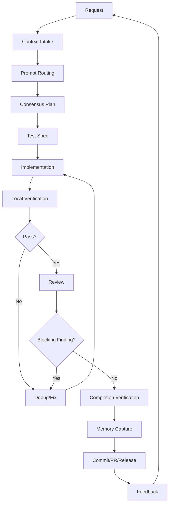

# PlotPilot Evolution Development Loop

This reference expands the `plotpilot-evolution-dev` skill. Load it when the task is larger than a one-file fix, involves multiple prompts/roles, or asks for planning, implementation, review, or release flow.

## Closed Loop



## Phase 0: Request Classification

Use `analyst` when the user intent is ambiguous. Use `planner` when intent is clear enough to plan.

Classify into one of:

- requirement clarification
- new Evolution capability
- implementation
- bug/debug
- review
- release
- documentation

Output:

- recommended Evolution skill path
- required Codex prompts
- default assumptions
- whether user input is genuinely required

## Phase 1: Context Intake

Gather:

- original request and latest correction from the user
- relevant files
- existing tests and artifacts
- constraints from `AGENTS.md`
- likely verification commands
- known uncertainty

For substantial work, write:

```text
.omx/context/evolution-<task-slug>-<timestamp>.md
```

Template:

```markdown
# Evolution Context Snapshot

## Task

## Desired Outcome

## Known Facts

## Constraints

## Prompt Roles To Use

## Files / Paths

## Unknowns

## Verification Targets
```

## Phase 2: Prompt Routing

Use the smallest prompt set that can complete the task.

| Scenario | Required | Optional |
| --- | --- | --- |
| new feature/skill | `planner`, `executor`, `test-engineer`, `verifier` | `architect`, `critic` |
| architecture/protocol | `planner`, `architect`, `critic` | `security-reviewer` |
| bug fix | `debugger`, `executor`, `verifier` | `test-engineer`, `build-fixer` |
| build/type failure | `build-fixer`, `verifier` | `debugger` |
| security-sensitive | `security-reviewer`, `architect`, `verifier` | `code-reviewer` |
| PR review | `code-reviewer`, `verifier` | `security-reviewer`, `code-simplifier` |
| docs | `writer`, `verifier` | `architect` |
| commit/PR/release | `git-master`, `writer`, `verifier` | `github:yeet` |

## Phase 3: Consensus Plan

Use `planner` first. Use `architect` for architecture soundness. Use `critic` to challenge missing risks, weak tests, and overbroad scope.

Plan must include:

- goals and non-goals
- files/modules touched
- data, permission, and safety boundaries
- test strategy
- acceptance criteria
- rollback or disable path

Do not implement from a vague plan.

## Phase 4: Test Spec

Use `test-engineer`.

For Evolution plugin/runtime work, consider:

- hook registration and dispatch behavior
- plugin enable/disable behavior
- Prompt Plaza seeding and rendering
- context injection budget and ordering
- chapter review authority and fallback paths
- smoke/pressure-test artifacts
- frontend plugin runtime events

Define which checks are automated and which are manual.

## Phase 5: Implementation

Use `executor`.

Rules:

- read existing patterns first
- write minimal diffs
- do not widen scope into unrelated cleanup
- preserve user/unrelated worktree changes
- avoid new dependencies
- keep prompt output contracts explicit and testable

For parallel subagents, only split independent work with disjoint write sets.

## Phase 6: Verification/Fix Loop

Use `verifier` for proof. Use `debugger` after a failed behavioral test. Use `build-fixer` after build/type/toolchain failures.

Loop:

1. run the proof command
2. read full output
3. identify one root-cause hypothesis
4. fix the smallest issue
5. rerun proof
6. after three failed hypotheses, ask `architect` for diagnosis

## Phase 7: Review

Use `code-reviewer`. Add `security-reviewer` for:

- filesystem access
- raw SQL or database boundaries
- admin tokens/API keys
- external commands
- MCP servers
- hooks or plugin permission boundaries
- network calls

Review order:

1. spec compliance
2. behavior regression
3. missing tests
4. security
5. maintainability

Blocking findings return to the fix loop.

## Phase 8: Completion Verification

Use `verifier`.

Check:

- acceptance criteria
- relevant tests
- docs match actual paths
- no temporary/debug leftovers
- no unresolved placeholder markers
- remaining gaps explicitly named

Do not claim completion without fresh evidence.

## Phase 9: Memory Capture

Use `writer` and `git-master`.

Capture only reusable knowledge:

- constraints
- rejected alternatives
- fragile boundaries
- verification commands
- future warnings

Good destinations:

- `docs/`
- `.omx/notepad.md`
- commit trailers following the Lore Commit Protocol

Avoid logging obvious diff facts.

## Phase 10: Release

Use `git-master`, `writer`, and `verifier`.

Release output should include:

- why the change exists
- changed files
- verification evidence
- not-tested gaps
- rollback/disable path
- Lore-style commit message

## Evolution-Specific Prompt Templates

### Planner

```text
You are planning PlotPilot Evolution work. Produce a grounded plan with:
1. goals and non-goals
2. repository evidence
3. touched files
4. prompt/role routing
5. implementation steps
6. tests and acceptance criteria
7. rollback or disable path

Do not invent codebase facts. Inspect first.
```

### Executor

```text
Implement the approved PlotPilot Evolution plan.

Rules:
- read relevant files first
- keep the diff minimal
- preserve unrelated worktree changes
- add or reuse tests
- run targeted verification
- report changed files and evidence
```

### Reviewer

```text
Review PlotPilot Evolution changes.

Findings first. Check:
- spec compliance
- hook/plugin boundary regressions
- prompt output contract drift
- missing tests
- security issues around paths, tokens, SQL, hooks, MCP, and external commands

Every finding needs file/line evidence and a concrete fix direction.
```

### Verifier

```text
Verify the Evolution task is complete.

Prove:
- acceptance criteria are met
- relevant tests pass
- docs and skill metadata match actual files
- no known errors remain
- not-tested gaps are explicit

Return PASS, FAIL, or PARTIAL with evidence.
```
